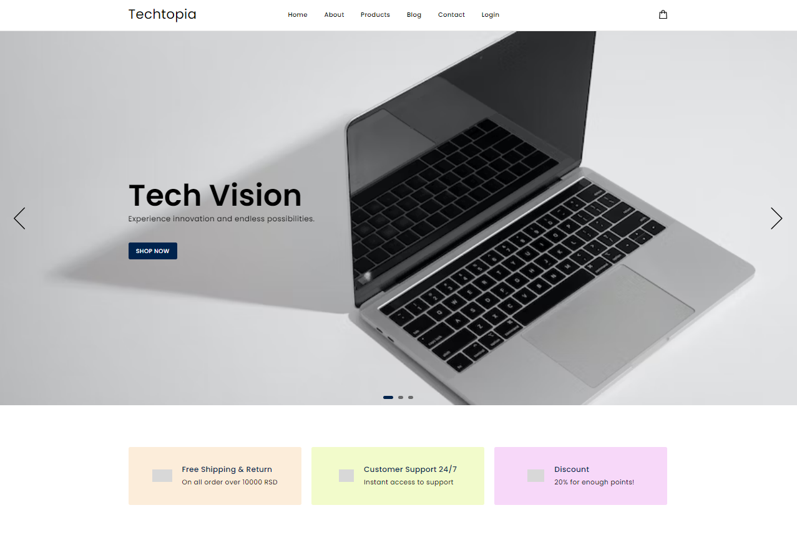

# TechTopia

## Description

ECommerce web application for technology and technological equipment. Created with Vue.js, Vue Router, Laravel and MySQL.

## Roles

1. Guest,
2. User,
3. Admin,
4. Menadzer

## Functionality

Authorization (with JWT):

1. Register,
2. Login,
3. Logout

When you are not authorized you can:

1. Add items to cart,
2. Remove items from cart
3. Order items
4. Send email

When you are authorized as User you can:

1. Add items to cart,
2. Remove items from cart,
3. Order items,
4. Track your orders,
5. Cancel your order,
6. You can collect points, if you order as a logged in user you get 10 points, when you collect 50 points you can use them to get a 20% discount on the total price,
7. Leave a comment on the blog,
8. Delete your comment

When you are authorized as Admin you can:

1. Users - list, get details, update (change user role to Admin or Manager, among other things) and delete,
2. Categories - create, list, get details, update, delete,
3. Brands - create, list, get details, update, delete,
4. Products - create, list, get details, update, delete,

When you are authorized as Manager you can:

1. Blogs - create, list, get details, update, delete,
2. Track all orders
3. Change order status,
4. Delete order

## Demo

You can check my application [here](https://techtopia.nonis.rs/).

## Index page

